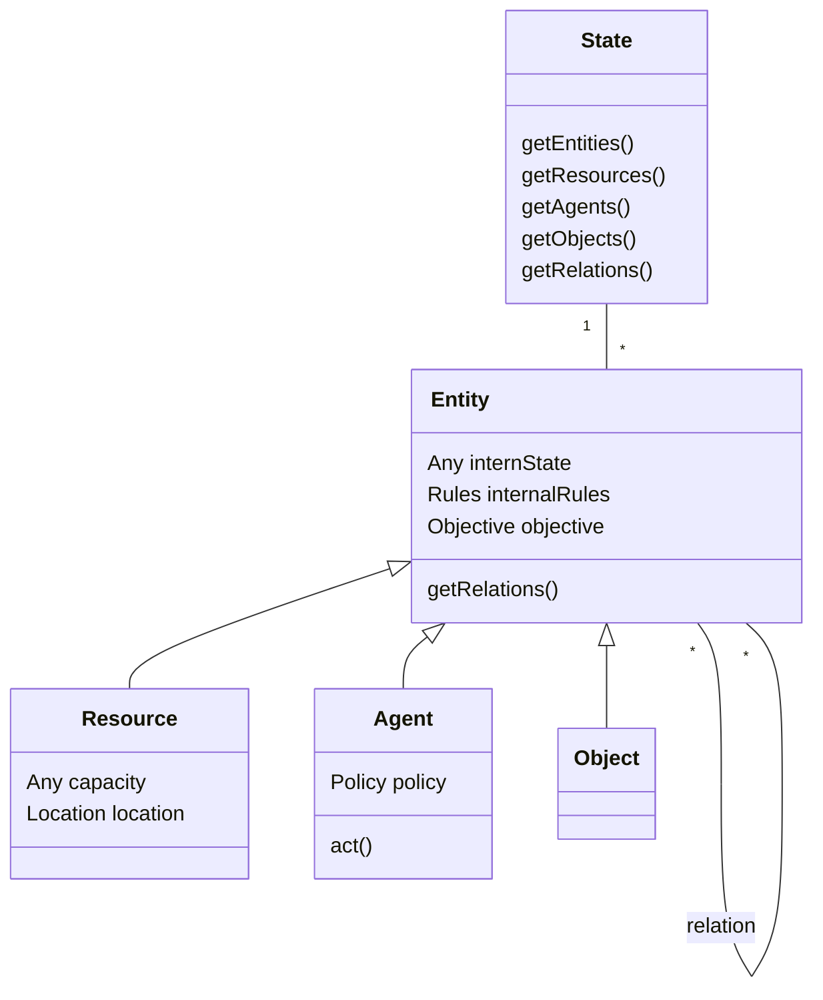
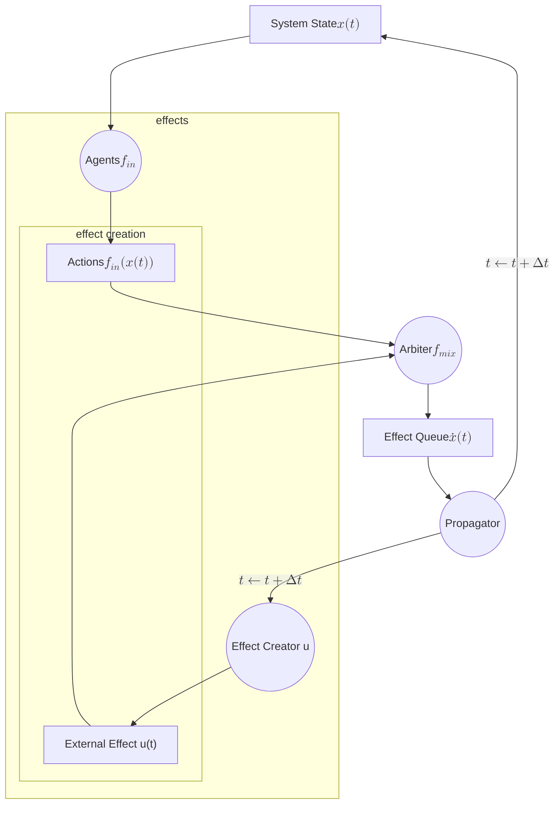
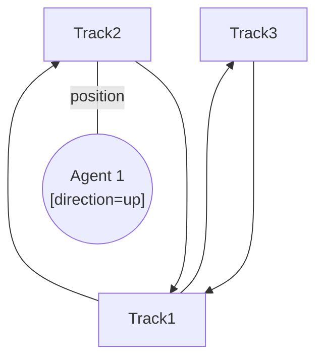
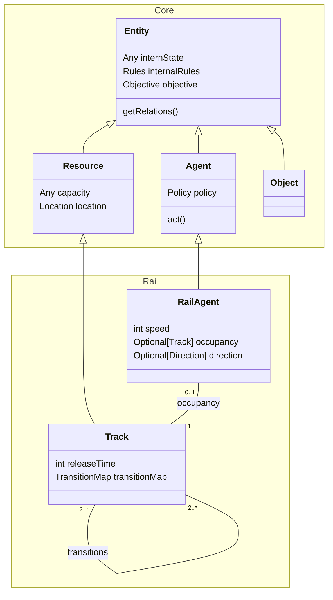

# Flatland Core Engine aka. Next Flatland

## Introduction

A dedicated core engine provides

* A clear framework for users to build their own application under a rigorous formulation
* Optimized core simulation functions agnostic to application, flexible for different potential applications, e.g. air
  traffic, power grid, robot control.

By doing so, we can

- Broaden the potential audience to contribute to the ecosystem
- Encourage solutions shared between different domains

### Flatland 3.0

Flatland's current implementation ([Flatland 3.0](https://www.aicrowd.com/challenges/flatland-3)) can have the following
problem:

* A highly railway-specific core implementation --> hard to include other applications
* Disorganized codebase --> extra difficulty to introduce new features
* Long computation time

## System State

The system state describes an observation containing all the information at a given time instance.
We describe a system as a relation graph.
A relation graph is a graph $G=(V,E)$ where we refer the vertices as entities and the edges as
relations. Details are stated below.

> [!NOTE]  
> System State = Entities + Relations

### Entities

Entities form the vertices of the relation graph, an entity must have the following basic attributes:

* State : The internal state representing the entity's own dynamics/attributes
* Rule : A set of internal rules to determine if a proposed effect with the current entity is allowed
  or not
* Objective : Objective influences the action posed on the entity

Further, we divide the entities into 3 classes.

* Resource : Resource to be allocated. Agents occupy or "use" the resources to achieve certain
  action. e.g. track of train system, bandwidth of internet, storage space of warehouse systems.
  Except the 3 basic attributes, a resource can also have other attributes like capacity ,
  location , etc.
* Agent : Agents drive the internal dynamics of the system. An agent has a policy , which is a
  mapping from current state (including agent, object, and resource's objectives) to an action.
  Agent is the only entity that can propose an action to modify the system.
* Object : Generic other entities that can interact with other entities, but has no ability to propose
  an action. e.g. passengers/cargo for a train

TODO class diagram

### Relations

A Relation defines the connection between entities. This implies the possible action can be
proposed, and the involved entities.
A Relation also attaches to a set of rule s that need to be considered while proposing an
effect involving the relation.

### Example

A basic example scenario can be shown as the following


* Resources have relations with other resources, e.g. train tracks connected to each other.
* Agents "use" specific resources and may have relation with other agents, e.g. trains occupy a
  segment of track, several trains cooperate with each other to pick up as many passengers as
  possible.
* Objects can be attached to agents or resources, e.g. passengers waiting on platform or taking a
  train.

Note that in general, a relation can be directed or undirected.

## System Dynamics

### Introduction

> [!NOTE]  
> System Dynamics = Actions from Agents based on System State, Effects from Agent Actions and Effect Creator, Arbiter
> checks validity and adds effects,
> Propagator updates the System State


Suppose the relation graph can completely describe the system, we have to define the dynamics of
the system to allow state evolution.
The basic idea is similar to a [state-space representation](https://en.wikipedia.org/wiki/State-space_representation)
where the changes of current state is
determined by the internal dynamics plus external forces. It can be expressed as
$$\dot{x}(t) = f_{mix}(f_{in}(x(t),u(t))$$
where

* $x(t)$ is the state of the system (see System State above),
* $u(t)$ are the external effects to the system (see Effect Creator below),
* $\dot{x}(t)$ is the changes of state with respect to time (see Effects and Propagator below),
* $f_{in}$ is an internal driver of evolution (see Actions below)
* $f_{mix}$ realizes the combination of internal and external drivers (see Arbiter below).

### Building Blocks of System Dynamics



Note: w.l.o.g., in this representation, relations do not have attributes (the internal static and dynamic attributes of
relations can be held as part of the
internal state of entities).

#### Effects

An effect is a proposed modification of the current state. It can only do the following:

* Change internal state of entities
* Add/remove relations
* Add/remove entities

For example, a movement of a train is an effect that proposes the following changes

* Remove the relation between the current track and the train
* Add a new relation to the new track it wants to travel to

A breakdown of a train or an agent is equivalent to Change internal state from operating to
malfunction.

#### Actions

An agent takes its current observable environment into account and proposes an action that tries
to trigger an effect based on its policy.
Agents' actions are the internal driver of state evolution. Or in plain words, agents act to change the
system in order to achieve its goal.

#### Effect Creator

A global generator of effects that is independent with any agent's current action. It serves as an
external driver of system evolution.

For example, an effect creator generates random malfunction to a track or introduces a new agent to
the system.

#### Rules

A rule is a statement that produces an answer yes or no . A rule takes the current state and
the proposed effect , generates a binary yes/no answer to accept the proposed effect or reject
it.

#### Arbiter

Arbiter takes a proposed effect and the set of rules involved for the proposal, decide whether
to accept or reject the effect.
An arbiter works in 2 levels

* Local: checks the rules regarding the change of an entity's internal state without considering
  the outside world
* Global: checks the rules regarding the relation between entities.
  Arbiter can also add new effect to the proposed effects to complete the state change.

For example, a train proposes to move from one track to another. If these two tracks involves a turn, the
arbiter adds another effect to change the train's internal state "direction" to the direction of the
new track.

#### Propagator

Given the valid effects , a propagator updates the system state (entities and relations). Note that if
multiple effects are propagated at the same time, the propagator needs to handle potential conflicts
between the effects.

### System Dynamics Flow

> [!NOTE]  
> System Dynamics = Actions from Agents based on System State, Effects from Agent Actions and Effect Creator, Arbiter
> checks validity and adds effects,
> Propagator updates the System State



## Examples

### Flatland 3.0

* Entities:
    * Resources: track segments, (stations)
    * Agents: trains, (malfunctions, if dependent on system state)
    * Objects: none
* Relations:
    * Agent-Resource: train occupies segment
    * Resource-Resource: transition map (e.g. switches)
* Rules:
    * Only one train can occupy a resource
    * The next train can occupy a resource only after some release time has passed
    * When an agent attempts to move, the direction of resource transition must agree the agent's
      current moving direction.
    * Moving to the next cell respects the train's speed
    * Event creator randomly stops some trains
* Effects:
    * upon entering grid:
    * upon entering cell:
        * add relation, update cell entered timestamp (or counter), clear exit timestamp (or counter)
          exit cell:
        * remove relation, update cell last occupied timestamp
    * upon changing position incl. entering/leaving grid ('position', agent, i,j,d)
    * upon malfunctions                                ('malfunction', agent, t)
      -> per agent:
        * keep track of last update (if None-> not entered)
        * keep track of malfunctioning state

Consider case 2 simple switch with 4 transitions (bottom <--> top and bottom <--> left).

Keep track of occupation direction (in agent or in track) and define rule to prevent illegals (physically impossible)
transition:





### Air Traffic

* Entities:
    * Resources: Airport runway, taxiway
    * Agent: Plane
    * Object: (Passenger), (fuel)
* Relations:
    * Agent-Resource: Plane occupies runway and taxiway
    * Resource-Resource: Possible connection between runway and taxiway; an airport's
      runway to another airport's runway
* Rules:
    * Only one plane can occupy segment of runway or taxiway
    * The direction of landing and taking off must agree the direction of plane
    * The number of objects must not exceed plane's capacity
* Effects:
    *

TODO class diagram

### Internet Packet Routing

* Entities:
    * Resources: Bandwidth of link, buffer
    * Agents: Switch, router
    * Objects: packets
* Relations:
    * Agent-Resource: An agent sends packets into a link and receives packets via its buffer
    * Agent-Agent: Possible connection between switches and routers
    * Agent-Object: Agent retrieves object based on packet priority and decide its next hop
      destination based on the packet's destination address
* Rules:
    * The packets must not exceed buffer size
    * An agent can only send a packet via a link with enough bandwidth
* Effects:
    *

Note: In this application, the moving object is not an agent but an object. Because by definition
an agent is the entity that makes action, not essentially moving. In a routing system, the destination
of a packet is written in the packet's header. However, the packets don't decide their own route, the
switches and routers decide the next hop for every incoming packet based on its own routing table.
Thus, in this case we demonstrate the power of this framework by a completely different setting.

TODO class diagram

### Energy Grid

TODO is this a resource allocation problem? What are the rules and

* Entities:
    * Resources: power lines, power stations (source), switching stations, power consumers (sink)
    * Agents: central operator
    * Objects: --
* Relations:
    * Resource-Resource: power line attached to power station or switching station
* Rules:
    * Respect capacity
* Effects:
    * Activate or deactivate link
    * Increase or decrease in production or consumption
    * Failure

TODO class diagram

## Setup

```shell
conda env update -f environment.yml
conda activate genenv
python gen_env.py
```

## Notation

https://mermaid.js.org/syntax/entityRelationshipDiagram.html