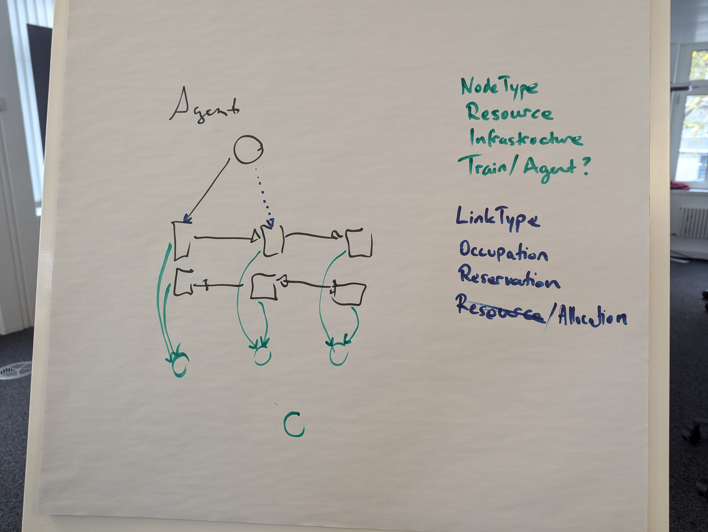

# Next Flatland

## Core Idea
The main idea was developed at the Flatland Workshop 2023. It has been written down initially by Christian Eichenberger here: [Concept](../documentation/core_concept.md)

## Discussion Workshop
During the 2024 workshop the Team:
- Merlin
- Thomas
- Florian
- Erik

Worked on a simple prototype to test the concept in code.

## Some Demo Plots
This is an example network: 
- We have two trains (Agents) 
- that move along the infrastructure
- to move they need resources
- they can only move if they have the resources
- so they reserve the resources in advance

This is the network after the trains have moved:
- For the next move they reserve again some infrastructure

This is the network after the trains have moved again:
- We can repeat this over and over again

## Open Questions
- Existing literature and libraries
 - What exists and can be reused?
- Arbiter
 - What do we do with conflicting atomic effects that happen later?

## Links

- [Agent-based modeling via graph rewriting](https://blog.algebraicjulia.org/post/2023/07/graphical-schedule/)

