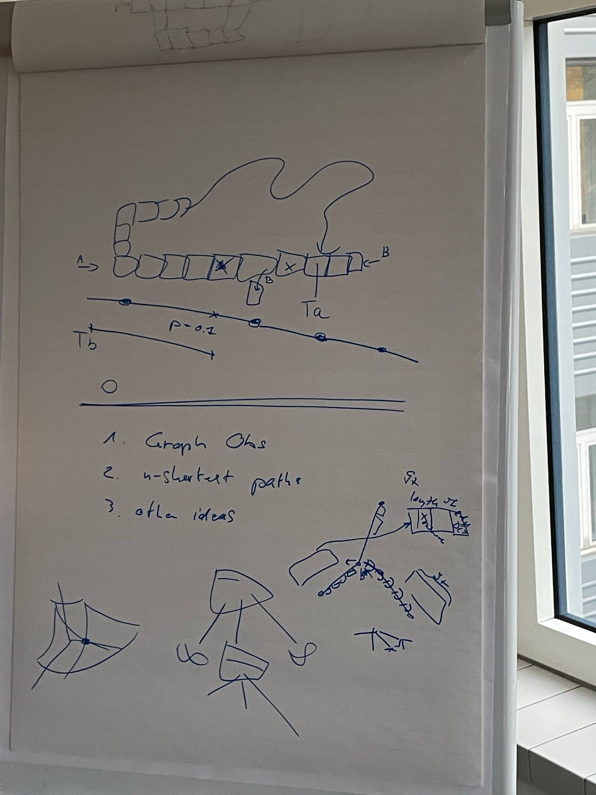

# Next Graph-Based Observation

## Objectives

1. ✅ Verify tree obs is collapsed (not intermedate cells)
2. 🔲 Re-create - integrate Alberto's solution into Flatland core
3. 🔲 What feature can we add to augment the information to conflict in Alberto's solution?

## Tree Obs

Current implementation is cell based.
However, there is a collapsed implementation [here](https://github.com/aiAdrian/flatland_railway_extension?tab=readme-ov-file).

## Alberto's approach

* will be open-sourced in the next few weeks. However, it's [maze](https://github.com/enlite-ai/maze)-based, not generic Flatland observation.
* pruned tree in-memory, list of features:

```text
Class for storing the node features

Each node information is composed of 14 features.


Missing/padding nodes are filled in with -inf (truncated).
Missing values in present node are filled in with +inf (truncated).
```

| feature                                 | description                                                                                                                                                                                                | Comments / discussion                                                                                                                                                                                                                                                                           |
|-----------------------------------------|------------------------------------------------------------------------------------------------------------------------------------------------------------------------------------------------------------|-------------------------------------------------------------------------------------------------------------------------------------------------------------------------------------------------------------------------------------------------------------------------------------------------|
| dist_own_target_encountered             | if own target lies on the explored branch the current distance from the original agent in number of cells is stored.                                                                                       |                                                                                                                                                                                                                                                                                                 |
| dist_other_target_encountered           | if another agents target is detected the distance in number of cells from the agents current location is stored                                                                                            |                                                                                                                                                                                                                                                                                                 |
| dist_other_agent_encountered            | if another agent is detected the distance in number of cells from current agent position is stored.                                                                                                        |                                                                                                                                                                                                                                                                                                 |
| dist_potential_conflict                 | Other agent predicts to pass along this cell at the same time as the agent, we store the distance in number of cells from current agent position. 0 = No other agent reserve the same cell at similar time | similar or same time? the "prediction" is at max speed on some explored branch? How many explored? Min if different paths pass there? --> only shortest path for other agent evalutated; at distance zero with alternative, this is not considered ca, not interesting to us as resolved anyway |
| idx_conflicting_agent                   | Idx of the agent creating the potential conflict.                                                                                                                                                          | conflicting and potential_conflict have the same semantics?   --> same                                                                                                                                                                                                                          |
| cell_of_conflict                        | Tuple holding the coordinate of the expected conflict                                                                                                                                                      |                                                                                                                                                                                                                                                                                                 |
| dist_other_agent_to_conflict            | Manhattan distance of the conflicting agent to the cell of conflict.                                                                                                                                       |                                                                                                                                                                                                                                                                                                 |
| clashing_agent_has_alternative          | Indicates whether the conflicting agent has or not an alternative. If not other possibilities then -> Certain conflict(?).                                                                                 | alternatives means any other paths not passing at the same at the location of conflict? --> any other path reaching target in time avoiding this exact conflict                                                                                                                                 |
| ca_expected_delay_for_alternative_path  | Stores the lowest possible delay following the 2nd shortest path.                                                                                                                                          |                                                                                                                                                                                                                                                                                                 |
| conflict_on_junction_with_multiple_path | Indicates whether the conflict will take place on a junction and the selected train has a free path to follow. Hence, not going to be blocked nor dead.                                                    | description unclear?    --> conflict on a switch and the other agent can go to the next cell not on "my" path                                                                                                                                                                                   |
| expected_delay_for_2nd_best_path        | Indicates the delay for resolving the conflict on the junction                                                                                                                                             | description unclear? --> 2nd best from the conflict position                                                                                                                                                                                                                                    |
| dist_unusable_switch                    | if a not usable switch (for agent) is detected we store the distance.                                                                                                                                      | an unusable switch is switch going into the agents path from the side, where the agent has only one option to continue?                                                                                                                                                                         |
| unusable_switch_usable_for_ca           | Indicates whether the unusable switch can be used by the conflicting agent.                                                                                                                                | is conflicting agent uniquely defined?  --> only layout 1 (straight) or 7 (dead-end) TODO does it still exist in Flatland 3 are non-switches, take the first one (see discussion above about "pruning")                                                                                         |
| unusable_switch_delay_for_ca            | Indicates the expected delay for the conflicting agent to use the switch.                                                                                                                                  | is conflicting agent uniquely defined?  --> dito                                                                                                                                                                                                                                                |
| dist_to_next_branch                     | the distance in number of cells to the next branching  (current node)                                                                                                                                      | that's the number of collapsed cells, right? --> yes, no of cells in that segment                                                                                                                                                                                                               |
| dist_min_to_target                      | minimum distance from node to the agent's target given the direction of the agent if this path is chosen                                                                                                   | description unclear? --> distance after this segment (starting from next decision point)                                                                                                                                                                                                        |
| num_agents_same_direction               | number of agents present same direction                                                                                                                                                                    | on the collapsed cells only or overall?                                                                                                                                                                                                                                                         |
| num_agents_opposite_direction           | number of agents present other direction than myself (so potential conflict)                                                                                                                               | dito                                                                                                                                                                                                                                                                                            |
| num_agents_malfunctioning               | number of time steps the observed agent remains blocked                                                                                                                                                    | dito                                                                                                                                                                                                                                                                                            |
| speed_min_fractional                    | slowest observed speed of an agent in same direction. (1 if no agent is observed)                                                                                                                          | dito                                                                                                                                                                                                                                                                                            |
| num_agents_ready_to_depart              | number of agents ready to depart but no yet active on the node.                                                                                                                                            |                                                                                                                                                                                                                                                                                                 |
| idx_deadlock_trains                     | idx of deadlocked trains.                                                                                                                                                                                  | unclear? --> actual deadlock (two trains face to face) in that collapsed segment                                                                                                                                                                                                                |
| childs                                  | childs node that can be reached from the parent.                                                                                                                                                           | so that's 4, each of which can be None (but not all unless target reached), right? --> B only valid on dead-ends, no dead-ends in env generator?                                                                                                                                                |



## Efficient Implementation?

The exploration is time-consuming.
Alberto reaches branch-depth max 3 to stay within submission limit. Corresponds to "cell-depth" of 10-25.


For Alberto's MCTS, TreeObs is the bigger bottleneck than serialization/de-serialization of intermediate states.

:warning: However, from a AI4RealNet Project Perspective, serialization/de-serialization has highest priority.

## Ideation of additional features

* n-shortest: weighted
  
* further ideas?

## Next steps

* Training environment to test out improvements? In Flatland or de-centralized? -> XGBoost compoare with trajectories from early training sortish.
* Read up Tree-LSTM paper
* Read up https://github.com/enlite-ai/maze
* Implementation probably makes sense on top of graph-based core instead of grid to graph conversion to actions on grid -> could already be usable right now as
  a "baseline", from that point of view maybe start early, Alberto not blocked, question of priorities... Open:
    * look up shortest paths in current implementation
    * use Adrian's graph for shortest path computations in the core as well?
    *

## Tangible Outcomes

* [Description (issue)](https://github.com/flatland-association/flatland-rl/issues/89)
  and [draft pr](https://github.com/flatland-association/flatland-rl/pull/90) of implementation in Flatland 3
* [Description (issue) of episodes for performance benchmarking](https://github.com/flatland-association/flatland-rl/issues/92)
* Take up Flatland dev coffee group (2 weekly) again
    * Slack for instant messaging
    * GitHub discussions

# Wrap-Up: Enhancements to Tree Observation (maybe to Graph/will support graph)

## Members of discussion:

* Christian Eichenberger (flatland, prev SBB)
* Alberto (EnliteAI)
* Farhad (DB)
* Jeremy (flatland)

## Motivations:

* Tree observation is slow and memory intensive (and so cannot provide sufficient depth)
* Provide an easily usable enhancement for the next Flatland iteration
    * Address concerns expressed by previous participants / researchers.
    * Improve performance but preserve ability to enhance / change

## Desirable Features from

* Improve features for potential future conflicts (mazerl Albreto obs)
* TreeLSTM observation
    * “Pruned” or shaped tree permits greater depth
    * C implementation improves performance but raises the barrier to reviews and modifications

This will work as a baseline to then extract high-level features to shape an observation.
Want to incorporate more multi-agent / comms features? Eg some form of “global” observation?

## Graph based Observation vs Graph Environment

The grid-based core of flatland is being increasingly seen as a technical burden. It was adopted historically because of the existing literature and examples
available. It is now a limitation.
However it will be somewhat radical to discard and replace the existing grid env.

We consider the interim step of a graph observation / translation built on the existing grid env:
Compute cost of translation
Burden of maintaining two views

Vs

Replace the various FL components with graph-based equivalents:

* Env generation
* Stepping engine
* Observations
* Persistence

## What can we do today to make a difference?

Very often agents follow their “predicted path” → recycle previous computation and update only the out-of-date information.
Currently the tree-observation has a depth specified in #cells. Graph-wise would be better to specify the depth of view as traversed edges.

How do we evaluate the cost of conversion?

We collect trajectories with several trains and different map sizes and then replay while enabling different observations. We can then benchmark the impact of
our proposal.

## EnhanceTreeObsForRailEnv Objectives
[Description](https://github.com/flatland-association/flatland-rl/issues/89)
* Control exploration by number of branches and not by number of cells to explore.
* Speed-up TreeObs: efficient data structure for "overlay" graph of decision points (for tree branches)
* Visualization of current state of overlay graph
* Add new features to TreeObsForRailEnv (currently 12)
* It should be easy to add new features

## Miscellaneous Considerations

Tree does not recombine. A graph obs based on the rail topology would recombine; but different agent paths may alight on a no
Flatland competition used constrained compute (4 cores for ~10 mins?)  
Monte-Carlo Tree Search (MCTS) requires “rewinding” of episodes back to “checkpoints”. We could build more support for this in the env. We already record
episode steps, and index into the PseudoRandom sequence. This could improve the performance of MCTS approaches by reducing the burden of env persistence.
