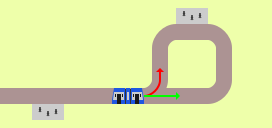

# Real-World Scenarios in **FLAT**LAND

This part is about finding real-world problems and infrastructures that should be depictable in Flatland.
The goal is not to implement whole real-world scenarios, but rather to identify the building blocks of our real world Flatland potentially could implement.
The building blocks are only named, described and explained -- they are not evaluated or judged, or garuanteed to be implemented in Flatland for that matter.

| Preview | Problem | Explanation / Example
|---|---|---
|  | Resources can be one-way | If a tram drives/stops on the wrong track, there won't be a platform for people to get out, thus in a station it's only allowed to drive on the "right" track.
|  | Resources are directional | The options for an agent on a switch depend on the direction it's approaching.
|  | Agents can be without objective | If a train reached its final destination, it does not have an objective any longer. However, it is still using a resource.
|  | Resources are reservable | A train may only enter a resource if the exit resource is also available. It has to reserve them both i.o.t. prevent dead-locks.
|  | Resources can be shared by different agent types | Even tho cars and trams do not drive on the same ground, they share the same space and therefore share one resource.
|  | Resources can be reserved for one agent type | Level crossings can be exclusively reserved for either a train or a car.