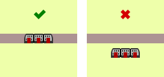
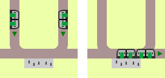

# Real-World Scenarios in **FLAT**LAND

This part is about finding real-world problems and infrastructures that should be depictable in Flatland.
The goal is not to implement whole real-world scenarios, but rather to identify the building blocks of our real world Flatland potentially could implement.

The building blocks are only named, described and explained -- they are not evaluated or judged, or garuanteed to be implemented in Flatland for that matter.

The building blocks are categorised and drawn in simplified manner. This should help to keep the list as tidy as possible.

## Finding and disassembling real world scenarios

Scenarios or their part problems could be thought of. However, railway and similar systems exist for quite a long time already[citation needed] and thus another valid approach is to look at real railway infrastructures, services and operation modes to extract the building blocks that make up e.g. a whole railway system.

The more building blocks there are found and implemented (or made possible to be implemented) in Flatland, the more use cases Flatland can handle.

### Microscopic infrastructure and principles

| Preview | Element | Explanation / Example | Domain
|---|---|---|---
|  | Track | Where agents can move (or be). | railway
| TODO | Track specifics | Track with specific length, vmax, gradient... | railway
| TODO | Switch | Where agents can take directional decisions. | railway
| TODO | Station | Where agents can start / stop their jurney. | railway
| TODO | Signal | Lets agents pass or halt. | railway
| TODO | Distant signal | Gives agents information about upcoming signal. | railway
| TODO | Cab signal | Gives agents real-time information about signals on line. | railway
| TODO | Axle counter | Senses passing of agent (directional). Allows localization of agent. | railway
| TODO | Balise (fixed) | Gives agent information about its location. | railway
| TODO | Balise (transparent) | Gives agent information about upcoming signals and more. | railway
| TODO | Radio | Allows agents to communicate with system (two way). | railway
| TODO | Block | Section of track occupied by an agent. | railway
| TODO | Block overlaps | Blocks that physically overlap on line. | railway
| TODO | Interlocking | Signals can depent on other signals, i.e. interlocked signals can only be operated as a group. | railway
| TODO | Reservation | Section of track reserved by an agent. | railway
| TODO | Speed profile | Agents have specific acceleration, max. speed, deceleration. | railway
| TODO | Length | Agents have specific length. | railway
| TODO | Size | Agents have specific space requirements. | railway
| TODO | Power type | Agents have specific types of fuel they rely on. | railway
| TODO | Power consumption | Agents have specific power intakes. | railway
| TODO | Power supply | Resources offer specific power supply. | railway
| TODO | Structure gauge | Tracks have specific space capacities. | railway
| TODO | Capacity | Agents have specific capacities for objects. | railway

### Infrastructure

| Preview | Problem | Explanation / Example | Domain
|---|---|---|---
| TODO | Resources can limit max. speed. | Bends preferably not to be taken at full speed. | railway
|  | Resources can be one-way | If a tram drives/stops on the track the wrong way, there won't be a platform for people to get out, thus in a station it's only allowed to drive on the "right" track. | tramway
|  | Resources are directional | The options for an agent on a switch depend on the direction it's approaching. | railway, tramway
|  | Resources are reservable | A train may only enter a resource if the exit resource is also available. It has to reserve them both i.o.t. prevent dead-locks. | railway, tramway
|  | Resources can be shared by different agent types | Even tho cars and trams do not drive on the same ground, they share the same space and therefore share one resource. | mix
|  | Resources can be reserved for one agent type | Level crossings can be exclusively reserved for either a train or a car. | mix

### Agent

| Preview | Problem | Explanation / Example | Domain
|---|---|---|---
| TODO | Agents can have different speed profiles | "IR" trains are more agile than freight trains. | railway
| TODO | Agents can have different capacities. | More people fit into "DOSTO" than "EC". | railway
| TODO | Agents can have different space requirements. | Short trams are indeed shorter than long trams. | tramway
|  | Agents can be without objective | If a train reached its final destination, it does not have an objective any longer. However, it is still using a resource. | railway
| TODO | Agents can be one-way | Some trams cannot reverse. | tramway

### Service (combining Infrastructure and agent)

| Preview | Problem | Explanation / Example | Domain
|---|---|---|---
| TODO | Speed profile depends on both resource vs. agent sub-type | Some switches have to be passed slow by certain train types. | railway
| TODO | Passage possible for certain agent sub-types only | Tunnels that are too low for "DOSTO" trains; electrified loks can only drive on electrified tracks; ETCS-1 trains can't drive on ETCS-2 tracks. | railway
| TODO | Disembarkment possible for certain agent sub-types only | Platforms that are too short for "IC" trains. | railway
| TODO | Turn around possible for certain agent sub-types only | Trams with doors on both sides can turn around at stations with "Spurwechsel". | tramway
|  | Connecting agents at stations | Some train types allow to be connected into one at certain stations (multiple starting points, common end point). | railway
| TODO | Disconnecting agents at stations | Some train types allow to split into two at certain stations (common starting point, multiple end points). | railway

### Failure modes and effects

| Preview | Problem | Explanation / Example | Domain
|---|---|---|---
| TODO | Agent arrives a little late | A train arrives a few minutes late at its destination for unmodelable reasons. | railway
| TODO | Agent arrives t>>0 late | A train arrives many minutes (e.g. > "Taktfahrplan-halbe") late | DB
| TODO | Agent can break down | Train stops completely. | railway
| TODO | Agent can partially break down | Train max. speed reduced. | railway
| TODO | Infrastructure can break down | Trains cannot pass. | railway
| TODO | Infrastructure can partially break down | Trains can pass at limited speed only. | railway
| TODO | Agent needs redirecting | E.g. in a medical emergency a train has to stop at the nearest possible stop, even if unplanned. | railway